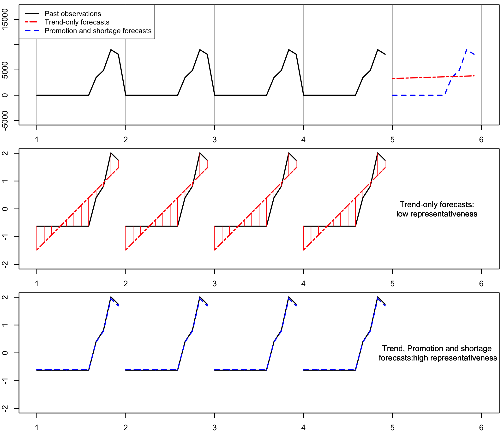

# Time Series Forecasting


## Project title and brief description
In this project, we will explore the M5 dataset, which contains historical sales data for various products across different stores. Our goal is to build robust time series forecasting models that take into account both promotional events and potential shortages.



### Data Exploration:
Understand the structure of the M5 dataset.
Identify relevant features such as sales, promotions, and stock levels.
Visualize trends, seasonality, and irregular patterns.
### Feature Engineering:
Create additional features related to promotions (e.g., binary indicators for promotion days).
Consider lagged features (previous sales, stock levels) to capture dependencies.
### Forecasting Models:
Explore various time series forecasting techniques:
ARIMA (AutoRegressive Integrated Moving Average): A classic method for modeling time series data.
Evaluate model performance using appropriate metrics (e.g., Mean Absolute Error, Root Mean Squared Error).
### Promotion Impact Analysis:
Investigate the effect of promotions on sales.
Quantify the lift in sales during promotional periods.
### Shortage Detection:
Detect potential stock shortages based on historical data.
Develop alerts or early warning systems for inventory management.
### Expected Outcome:
By the end of this project, we aim to create accurate forecasts that account for promotions and potential shortages, helping businesses make informed decisions about inventory management and sales strategies.

## Installation instructions
R package *forecast*, *smooth*, *m5* is used for producing forecast with ETS, ARIMA, Theta, forecasts with ETS for the weekly and hourly data and downloading m5 dataset.
```
install.packages("forecast")
install.packages("smooth")
install.packages("m5")

```
## Usage instructions

## Results and insights

## Acknowledgments
